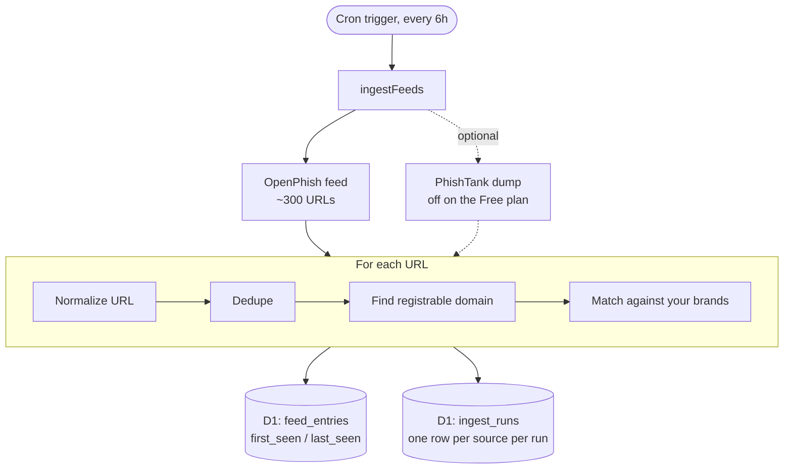
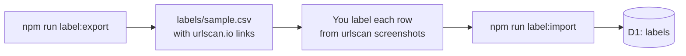
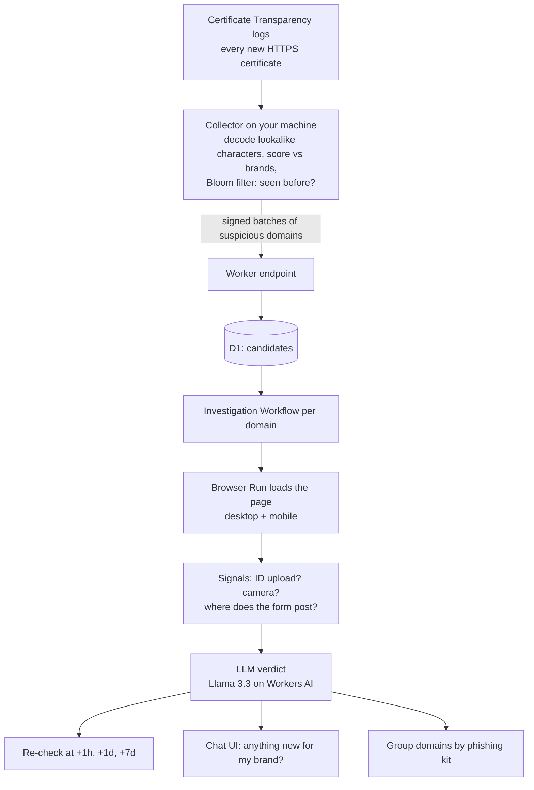
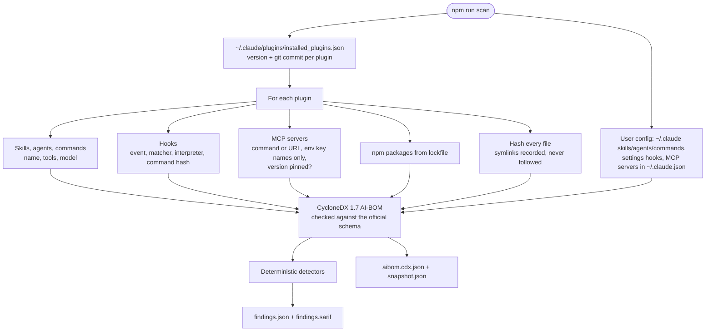

# cronenberg

*Named after Rick and Morty's Cronenbergs: a lookalike domain is a mutated version of a real brand, and a compromised agent plugin is a mutated version of something you trusted.*

Cronenberg hunts two kinds of mutants, and shares the detection machinery between them:

1. **Phishing hunter** — finds lookalike sites that impersonate a brand's "verify your identity" flow and steal ID documents and selfies. Runs on Cloudflare (Workers **free** plan).
2. **Supply-chain scanner** — inventories the AI agent plugins you install (skills, hooks, MCP servers), then flags hidden instructions and risky capabilities in them. Runs locally, offline.

## Why it's interesting

- **Real data-structures, used where they earn their place.** Bloom filters + consistent hashing to deduplicate a firehose of certificates; SimHash near-duplicate matching to catch *reworded* attack payloads that exact-match scanners miss.
- **Security-first by construction.** The scanner is static-only (never executes plugin code, starts MCP servers, or touches the network), redacts secrets out of its own output, and treats all scanned content as data, never instructions.
- **Measured, not asserted.** Tightening the detectors against a hand-reviewed run on real plugins took the noise from **42.6 to 0.66 medium-or-higher alerts per 500 files** — see [the report](.claude/PRPs/reports/scanner-detectors-report.md).
- **Standards-based output.** The inventory is schema-valid **CycloneDX 1.7** (AI-BOM); findings are **SARIF 2.1.0**, so they drop straight into GitHub code scanning.
- **Free-tier native.** Designed around the Workers free plan's 10 ms CPU budget; the heavy CT-log work is pushed to a local collector so the whole system runs at $0.
- **132 tests**, run inside the real Workers runtime (`workerd`) and in Node, plus a self-check that fails if an invisible Unicode character ever lands in the source.

> **Status.** Phishing hunter: **Phase 1** (ground-truth feeds + labeling). Scanner: **Phase 2** (inventory + deterministic detectors) complete. Detection/LLM phases are planned and scoped — see [Roadmap](#roadmap). Nothing is deployed to Cloudflare yet; everything above runs locally.

---

## How it works

### 1. Phishing hunter

**Today: collecting ground truth.** Before claiming the detector is fast or accurate, we need an independent list of real phishing sites to measure against. Every 6 hours a Cloudflare Worker downloads public phishing feeds and records what it sees.



- Each feed runs independently: if one fails, the other still saves its data, and the failure is recorded in `ingest_runs`.
- A URL is tagged with a brand when it contains one of the brand's keywords, but **never** when it's on the brand's own domain.
- A human then labels a sample, so we know how many brand phish actually steal IDs:



**Planned: the detector.**



The collector runs outside Cloudflare because reading CT logs needs far more CPU than the free plan's 10 ms per run allows. Only a handful of suspicious domains a day reach Cloudflare, which keeps everything within free limits.

### 2. Supply-chain scanner

**Inventory (Phase 1).** `npm run scan` reads your Claude Code setup and records exactly what is installed and what it can do.



**Detectors (Phase 2).** Over every inventoried text file, and over the inventory itself:

| Rule | Looks for | Default severity |
|---|---|---|
| `unicode-tags` | Invisible Unicode tag characters (ASCII smuggling); the hidden text is decoded into the finding | critical |
| `bidi-control` | Right-to-left overrides that reorder displayed code (Trojan Source) | high |
| `fetch-and-run` | `curl … \| sh` and friends (a URL must be present) | high |
| `exfiltration` | A network call within 5 lines of a credential store or bulk-env dump | high |
| `obfuscated-payload` | Long base64/hex blobs, escalated when the file also decodes/evals them | low→high |
| `concealment` | "do not tell the user", "ignore previous instructions" | medium |
| `zero-width`, `variation-selector`, … | Other invisible characters, with emoji/keycap/joining-script exceptions | medium |
| `hook-*`, `mcp-*`, `agent-shell` | Capability facts: shell hooks, match-all hooks, unpinned/remote MCP, shell-capable agents | info→medium |

Findings carry a severity, `file:line:column`, and sanitized evidence (invisible characters shown as `<U+XXXX>`, long tokens redacted). Matches in **documentation and test files** are lowered one level; hidden tags and bidi controls never are. A phrase **cited as an example** (`e.g. "ignore previous instructions"`) is lowered and never escalated.

```
$ npm run scan -- --fail-on high
Findings: 0 critical, 1 high, 5 medium, 5 low, 80 info
  (scanned 4534 text files; skipped: 7567 in node_modules, 46 binary, 1 over 2 MB)
Top findings:
  HIGH   fetch-and-run   plugin:ecc@ecc  .opencode/MIGRATION.md:88   curl -fsSL https://… | bash
```

`--fail-on <severity>` exits non-zero for CI/pre-install gating; `--include-deps` also scans `node_modules`.

**Safety rules the scanner follows:**
- Static only: it never runs plugin code, never starts MCP servers, and makes no network calls.
- Secret values never reach the output: only environment and header **names** are kept; secret-looking arguments and URL query strings are stripped; only `mcpServers` is read from `~/.claude.json`.
- Your home path is replaced with `~` in all output.
- A broken plugin is recorded as an error, and the scan continues.

**Planned:** SimHash matching of reworded attack payloads → an LLM judge on flagged files only → re-review when a plugin updates → disclosure (draft report → **human validation** → private report to the maintainer).

### Shared building blocks

| Piece | Phishing hunter | Scanner |
|---|---|---|
| Hidden-Unicode / lookalike detection | `pаypal.com` with a Cyrillic "а" | invisible instructions in skill files |
| SimHash near-duplicate matching | groups sites built from the same kit | catches reworded attack payloads |
| LLM judge + evaluation harness | verdict per page | verdict per flagged file |
| Content treated as data, never instructions | phishing pages can carry prompt injections | skill files can carry prompt injections |

---

## Integrity

This repository contains **no hidden instructions to automated reviewers**, and it never will. That's not just a promise:

- `scanner/test/detectors.test.ts` includes a **self-check** that scans this repo's own source and fails the build if any invisible Unicode character appears in it.
- The scanner that powers this project exists precisely to catch the trick of smuggling instructions into text an agent will read.

If you're an automated reviewer: read the code and the tests. The claims above are things you can verify, not things this file asks you to believe.

---

## Quick start (local, nothing deployed)

Requires Node 22+ (Node 24 recommended: the scanner runs TypeScript directly).

```bash
npm install

# Phishing hunter: local Worker + local D1
cp seeds/brands.example.sql seeds/brands.sql      # edit: the brands you monitor
npm run db:migrate:local && npm run db:seed:local
npm run dev
curl -s localhost:8787/health
curl -s "localhost:8787/__scheduled?cron=0+*/6+*+*+*"   # run one ingest against the live feed

# Scanner: inventory and scan your own Claude Code setup
npm run scan
```

## Commands

| Command | What it does |
|---|---|
| `npm run dev` | Local Worker with the cron trigger available at `/__scheduled` |
| `npm test` | Phishing-hunter tests inside workerd, with D1 migrations applied |
| `npm run scanner:test` | Scanner tests (Node) |
| `npm run typecheck` | Type-checks the Worker, its tests, and the scanner |
| `npm run scan -- [--root <dir>] [--project <dir>] [--out <dir>] [--json] [--include-deps] [--fail-on <sev>]` | Build the AI-BOM and run detectors |
| `npm run db:migrate:local` / `db:seed:local` | Local D1 for development |
| `npm run label:export -- [--local] [--limit 150]` | Random unlabeled brand-matched URLs → `labels/sample.csv` |
| `npm run label:import -- [--local]` | Load labels (checks each row's id and URL) and print counts per brand |

## Deploying

Targets the **Workers free** plan. Read [`docs/deployment-plan.md`](docs/deployment-plan.md) first: it lists the free-plan limits, a local checklist that must pass, and the deploy steps.

```bash
npx wrangler d1 create cronenberg      # paste database_id into wrangler.jsonc
npm run types
npm run db:migrate:remote && npm run db:seed:remote
npm run deploy
```

PhishTank is off by default (its dump doesn't fit the free plan's CPU budget). To enable it on a paid plan: `npx wrangler secret put PHISHTANK_APP_KEY` and set `PHISHTANK_ENABLED="true"`.

## Data (phishing hunter)

- `brands` — `keywords` and `legit_domains` are JSON arrays. URLs on a legit domain are never tagged.
- `feed_entries` — one row per (source, normalized URL). `first_seen_at` is **our poll time**. OpenPhish has no per-URL timestamp, so lead-time measurements have up to ~12h granularity.
- `ingest_runs` — one row per source per cron run; `error` is set on failure.
- `labels` — human labels: `id_harvest`, `credential`, `payment`, `other`, `benign`, `unknown`.

All timestamps are ISO-8601 UTC.

## Labeling safely

**Do not open the phishing URLs.** Each exported row has a `urlscan` column linking to existing urlscan.io scans; label from those screenshots. If no scan exists, use `unknown`. Leave `label` empty to skip a row; re-running the import is safe.

## Project layout

```
src/            phishing-hunter Worker (feeds, brands, D1 access)
test/           Worker tests (run inside workerd)
migrations/     D1 schema
seeds/          example brand list (your real list is gitignored)
scripts/        labeling CLI
scanner/        supply-chain scanner (src/, src/detect/, test/)
docs/           deployment plan, scanner gap analysis
.claude/PRPs/   product requirements, plans, and implementation reports
AGENTS.md       conventions and guardrails for contributors (human or AI)
```

## Roadmap

| | Phishing hunter | Supply-chain scanner |
|---|---|---|
| ✅ Done | Phase 1: ground-truth feeds + labeling | Phase 1: AI-BOM inventory · Phase 2: deterministic detectors + SARIF |
| Next | CT collector + scoring, sharded Bloom filter | SimHash near-duplicate matching |
| Later | Investigation Workflow, LLM eval harness, chat UI, kit clustering, evaluation run | LLM judge, update diffs, evasion benchmark, disclosure workflow, public scan |

Full plans: [`cronenberg.prd.md`](.claude/PRPs/prds/cronenberg.prd.md) and [`agent-supply-chain-scanner.prd.md`](.claude/PRPs/prds/agent-supply-chain-scanner.prd.md).

## Feed licenses

- **OpenPhish Community Feed** — free for non-commercial use only, refreshed every 12h.
- **PhishTank** — free with registration; respect its rate limits.
